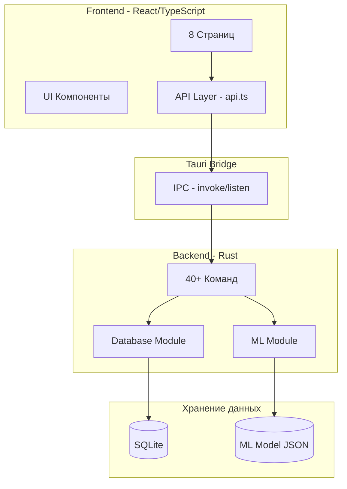
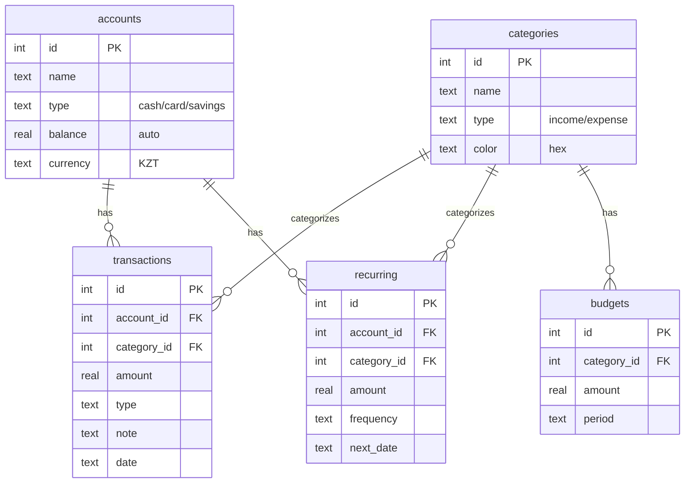
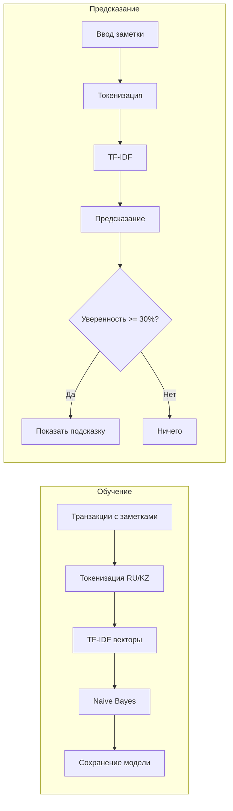
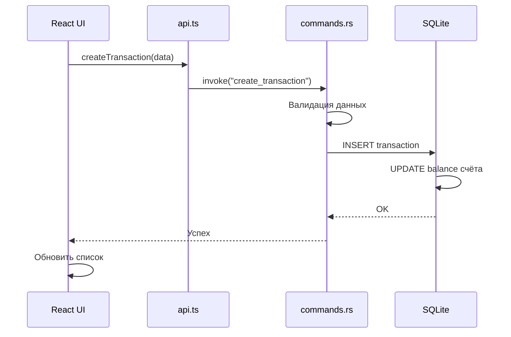

# Анализ проекта "Личная бухгалтерия"

## Что это за проект?

Это десктопное приложение для учёта личных финансов, которое работает полностью **офлайн** — все данные хранятся локально на компьютере пользователя. Приложение имеет встроенное **машинное обучение** для умных подсказок.

---

## Технологический стек

- **Frontend**: React 19 + TypeScript + Tailwind CSS 4
- **Backend**: Rust + Tauri 2
- **База данных**: SQLite (локальная)
- **ML**: Нативный Rust (TF-IDF + Naive Bayes)
- **Тестирование**: Vitest + Playwright

---

## Архитектура приложения

---

## Структура проекта

### Frontend (`[src/](src/)`)

| Папка                                | Назначение                                                                                       |
| ------------------------------------ | ------------------------------------------------------------------------------------------------ |
| `[src/pages/](src/pages/)`           | 8 страниц: Dashboard, Transactions, Accounts, Categories, Recurring, Reports, Insights, Settings |
| `[src/components/](src/components/)` | Layout (Sidebar, Header), UI компоненты (Toast, ConfirmDialog, EmptyState)                       |
| `[src/lib/api.ts](src/lib/api.ts)`   | 40+ методов для связи с Rust бэкендом                                                            |
| `[src/stores/](src/stores/)`         | Управление темой (светлая/тёмная)                                                                |

### Backend (`[src-tauri/](src-tauri/)`)

| Файл                                                     | Назначение                          |
| -------------------------------------------------------- | ----------------------------------- |
| `[src-tauri/src/lib.rs](src-tauri/src/lib.rs)`           | Точка входа, регистрация 40+ команд |
| `[src-tauri/src/commands.rs](src-tauri/src/commands.rs)` | Все Tauri команды + валидация       |
| `[src-tauri/src/db/](src-tauri/src/db/)`                 | Работа с SQLite (schema, queries)   |
| `[src-tauri/src/ml/](src-tauri/src/ml/)`                 | Machine Learning модуль             |

---

## База данных

**Предустановленные категории:**

- Доходы: Зарплата, Подработка
- Расходы: Еда, Транспорт, Коммунальные, Здоровье, Развлечения, Одежда, Прочее

---

## ML Pipeline (Машинное обучение)

**Возможности ML:**

- **Предсказание категории** — по тексту заметки предлагает категорию
- **Детекция аномалий** — Z-score для выявления необычных трат
- **Прогноз расходов** — Exponential Smoothing для предсказания трат на следующий месяц

---

## Data Flow: Создание транзакции

---

## Основные функции приложения

- **Счета**: cash, card, savings с автоматическим подсчётом баланса
- **Транзакции**: доходы и расходы с фильтрами и поиском
- **Переводы**: между счетами (атомарная операция)
- **Категории**: с иерархией и цветами
- **Регулярные платежи**: автоматические транзакции по расписанию
- **Бюджеты**: лимиты по категориям с оповещениями
- **Отчёты**: графики (Pie Chart, Bar Chart) через Recharts
- **Резервное копирование**: экспорт/импорт базы данных
- **Темы**: светлая и тёмная

---

## Безопасность

- Валидация всех входных данных в Rust
- Параметризованные SQL запросы (защита от SQL injection)
- Проверка целостности при восстановлении бэкапа
- Atomic транзакции при переводах между счетами

---

## Простым языком

Представьте это приложение как **личную записную книжку для денег**, которая:

1. **Живёт на вашем компьютере** — не нужен интернет, ваши данные не уходят никуда
2. **Запоминает все ваши траты** — когда вы вводите "оплата в Glovo за пиццу", оно запоминает это в категорию "Еда"
3. **Учится на ваших привычках** — после 20+ записей начинает само угадывать категорию по описанию
4. **Следит за аномалиями** — если вы потратили в 3 раза больше обычного на развлечения, оно предупредит
5. **Предсказывает будущее** — на основе истории расходов показывает, сколько примерно потратите в следующем месяце
6. **Красивый интерфейс** — тёмная и светлая тема, анимации, графики

**Технически**: React показывает кнопки и формы, Rust считает деньги и хранит в SQLite, машинное обучение угадывает категории. Всё это упаковано в одно приложение через Tauri (технология от создателей VS Code).