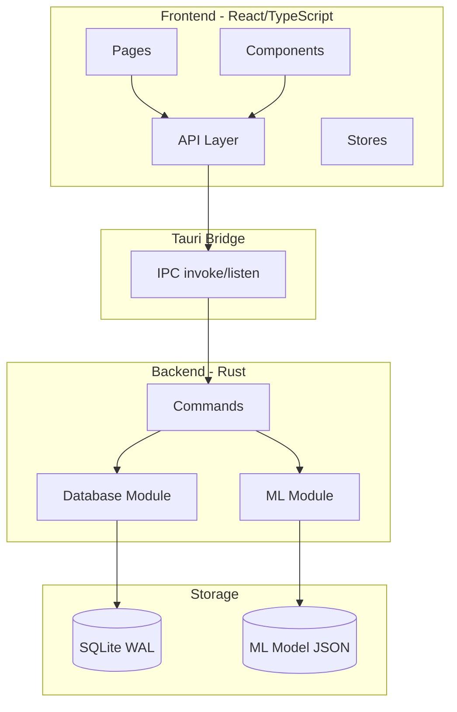
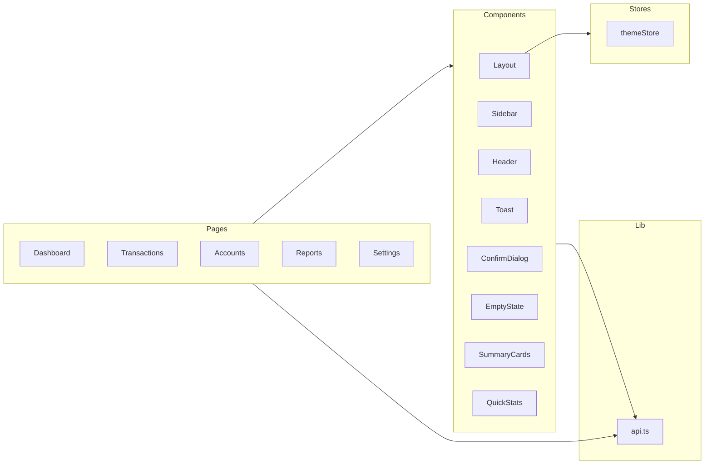
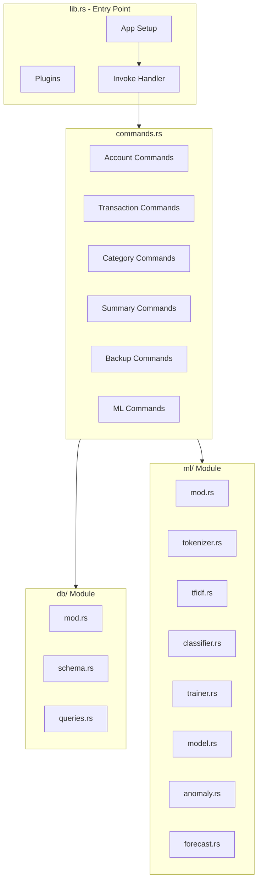
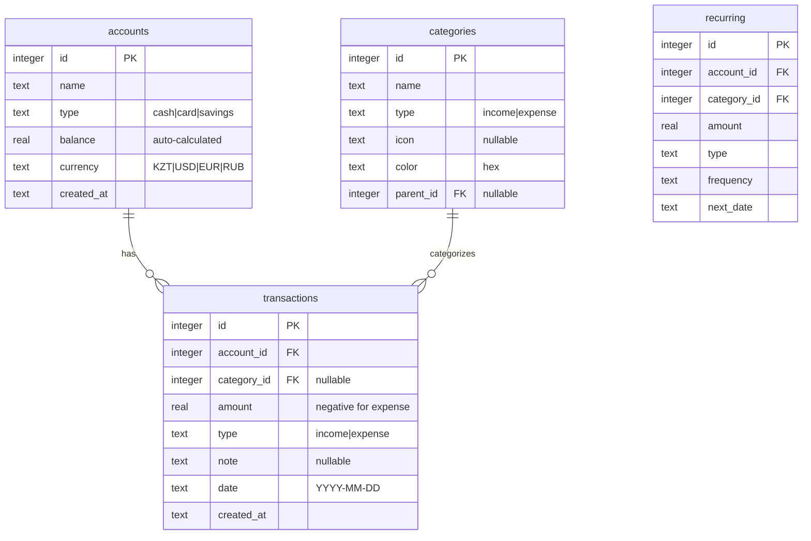
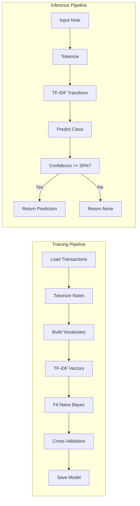
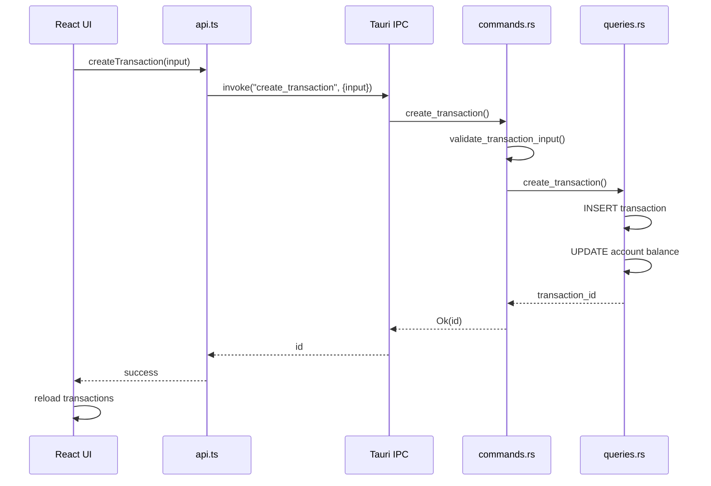
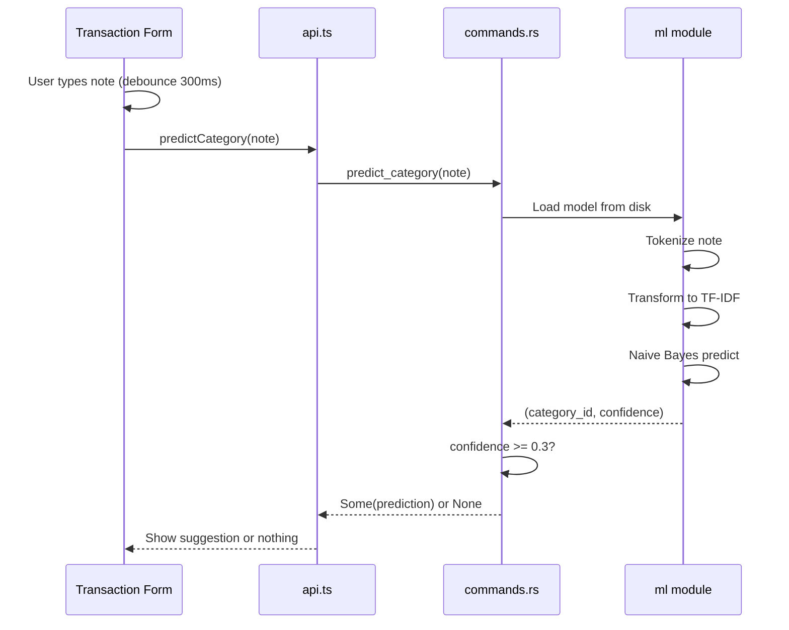
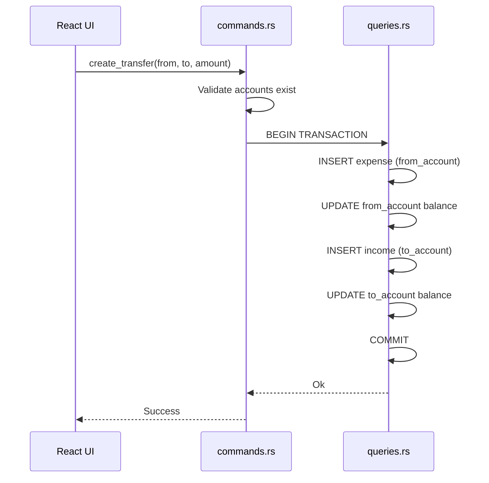

# Архитектура приложения "Личная бухгалтерия"

Полная техническая документация десктопного приложения для учёта личных финансов.

## Содержание

1. [Обзор системы](#1-обзор-системы)
2. [Слои архитектуры](#2-слои-архитектуры)
3. [Схема базы данных](#3-схема-базы-данных)
4. [API Reference](#4-api-reference)
5. [ML Pipeline](#5-ml-pipeline)
6. [Data Flow](#6-data-flow)
7. [Структура файлов](#7-структура-файлов)
8. [Безопасность и валидация](#8-безопасность-и-валидация)
9. [Storage](#9-storage)
10. [UI/UX Design System](#10-uiux-design-system)
11. [Roadmap](#11-roadmap)

---

## 1. Обзор системы

Десктопное приложение для учёта личных финансов, работающее полностью офлайн. Все данные хранятся локально в SQLite. Встроенный ML-модуль предсказывает категории транзакций и выявляет аномалии в расходах.

### Технический стек

| Слой | Технологии |
|------|------------|
| **Frontend** | React 19, TypeScript 5.8, Tailwind CSS 4, Vite 7, React Router 7, Recharts 3.7 |
| **Backend** | Rust 2021, Tauri 2, rusqlite 0.32 |
| **Database** | SQLite (WAL mode) |
| **ML** | Нативный Rust (TF-IDF, Naive Bayes) |

### Высокоуровневая архитектура



---

## 2. Слои архитектуры

### 2.1 Frontend Layer

**Технологии:** React 19, TypeScript 5.8, Tailwind CSS 4, Vite 7



**Ключевые файлы:**

| Файл | Назначение |
|------|------------|
| `src/App.tsx` | Маршрутизация (React Router 7) |
| `src/lib/api.ts` | Обёртки над Tauri invoke |
| `src/stores/themeStore.ts` | Управление темой (localStorage) |
| `src/hooks/useDebounce.ts` | Debounce для ML предсказаний |

### 2.2 Backend Layer

**Технологии:** Rust 2021, Tauri 2, rusqlite 0.32



**Ключевые файлы:**

| Файл | Назначение |
|------|------------|
| `src-tauri/src/lib.rs` | Точка входа, регистрация команд |
| `src-tauri/src/commands.rs` | 24 Tauri команды |
| `src-tauri/src/db/queries.rs` | SQL операции |
| `src-tauri/src/ml/` | Machine Learning модуль |

---

## 3. Схема базы данных

### ER-диаграмма



### DDL

```sql
CREATE TABLE IF NOT EXISTS accounts (
    id INTEGER PRIMARY KEY AUTOINCREMENT,
    name TEXT NOT NULL,
    type TEXT NOT NULL,
    balance REAL DEFAULT 0,
    currency TEXT DEFAULT 'KZT',
    created_at TEXT DEFAULT CURRENT_TIMESTAMP
);

CREATE TABLE IF NOT EXISTS categories (
    id INTEGER PRIMARY KEY AUTOINCREMENT,
    name TEXT NOT NULL,
    type TEXT NOT NULL,
    icon TEXT,
    color TEXT,
    parent_id INTEGER REFERENCES categories(id)
);

CREATE TABLE IF NOT EXISTS transactions (
    id INTEGER PRIMARY KEY AUTOINCREMENT,
    account_id INTEGER NOT NULL REFERENCES accounts(id),
    category_id INTEGER REFERENCES categories(id),
    amount REAL NOT NULL,
    type TEXT NOT NULL,
    note TEXT,
    date TEXT NOT NULL,
    created_at TEXT DEFAULT CURRENT_TIMESTAMP
);

CREATE TABLE IF NOT EXISTS recurring (
    id INTEGER PRIMARY KEY AUTOINCREMENT,
    account_id INTEGER REFERENCES accounts(id),
    category_id INTEGER REFERENCES categories(id),
    amount REAL NOT NULL,
    type TEXT NOT NULL,
    frequency TEXT,
    next_date TEXT
);
```

### Индексы

```sql
CREATE INDEX IF NOT EXISTS idx_transactions_date ON transactions(date);
CREATE INDEX IF NOT EXISTS idx_transactions_account ON transactions(account_id);
CREATE INDEX IF NOT EXISTS idx_transactions_category ON transactions(category_id);
```

### Предустановленные категории

| Категория | Тип | Цвет |
|-----------|-----|------|
| Зарплата | income | `#22c55e` |
| Подработка | income | `#3b82f6` |
| Еда | expense | `#ef4444` |
| Транспорт | expense | `#f97316` |
| Коммунальные | expense | `#eab308` |
| Здоровье | expense | `#ec4899` |
| Развлечения | expense | `#8b5cf6` |
| Одежда | expense | `#06b6d4` |
| Прочее | expense | `#64748b` |

---

## 4. API Reference

### 4.1 Accounts API

| Команда | Входные данные | Выход | Описание |
|---------|----------------|-------|----------|
| `get_accounts` | — | `Vec<Account>` | Получить все счета |
| `create_account` | `{name, account_type, currency?}` | `i64` | Создать счёт |
| `update_account` | `{id, name, account_type, currency?}` | `()` | Обновить счёт |
| `delete_account` | `id: i64` | `()` | Удалить (если нет транзакций) |

**Типы:**

```typescript
interface Account {
  id: number;
  name: string;
  account_type: string;  // "cash" | "card" | "savings"
  balance: number;
  currency: string;
}
```

### 4.2 Categories API

| Команда | Входные данные | Выход | Описание |
|---------|----------------|-------|----------|
| `get_categories` | — | `Vec<Category>` | Получить все категории |

**Типы:**

```typescript
interface Category {
  id: number;
  name: string;
  category_type: string;  // "income" | "expense"
  icon: string | null;
  color: string | null;
}
```

### 4.3 Transactions API

| Команда | Входные данные | Выход | Описание |
|---------|----------------|-------|----------|
| `get_transactions` | `{limit?, account_id?, date_from?, date_to?, category_id?, transaction_type?, search_note?}` | `Vec<TransactionWithDetails>` | Получить с фильтрами |
| `create_transaction` | `{account_id, category_id?, amount, transaction_type, note?, date}` | `i64` | Создать транзакцию |
| `update_transaction` | `{id, account_id, category_id?, amount, transaction_type, note?, date}` | `()` | Обновить транзакцию |
| `delete_transaction` | `id: i64` | `()` | Удалить транзакцию |
| `create_transfer` | `{from_account_id, to_account_id, amount, date, note?}` | `()` | Перевод между счетами |

**Типы:**

```typescript
interface TransactionWithDetails {
  id: number;
  account_id: number;
  account_name: string;
  category_id: number | null;
  category_name: string | null;
  amount: number;
  transaction_type: string;  // "income" | "expense"
  note: string | null;
  date: string;  // YYYY-MM-DD
}
```

### 4.4 Analytics API

| Команда | Входные данные | Выход | Описание |
|---------|----------------|-------|----------|
| `get_summary` | — | `Summary` | Баланс, доход/расход за месяц |
| `get_expense_by_category` | `{year, month}` | `Vec<CategoryTotal>` | Расходы по категориям |
| `get_monthly_totals` | `{months?}` | `Vec<MonthlyTotal>` | Статистика по месяцам |

**Типы:**

```typescript
interface Summary {
  total_balance: number;
  income_month: number;
  expense_month: number;
}

interface CategoryTotal {
  category_name: string;
  total: number;
}

interface MonthlyTotal {
  month: string;  // "MM.YYYY"
  income: number;
  expense: number;
}
```

### 4.5 Backup API

| Команда | Входные данные | Выход | Описание |
|---------|----------------|-------|----------|
| `export_backup` | — | `String` | Создать копию БД, вернуть путь |
| `restore_backup` | `path: String` | `()` | Восстановить из файла |

### 4.6 ML API

| Команда | Входные данные | Выход | Описание |
|---------|----------------|-------|----------|
| `predict_category` | `note: String` | `Option<CategoryPrediction>` | Предсказать категорию |
| `train_model` | — | `TrainResult` | Обучить модель |
| `get_model_status` | — | `ModelStatus` | Статус модели |
| `get_insights` | — | `Insights` | Аномалии и прогноз |

**Типы:**

```typescript
interface CategoryPrediction {
  category_id: number;
  category_name: string;
  confidence: number;  // 0.0 - 1.0
}

interface TrainResult {
  success: boolean;
  sample_count: number;
  accuracy: number | null;
  message: string;
}

interface ModelStatus {
  trained: boolean;
  trained_at: string | null;
  sample_count: number | null;
  accuracy: number | null;
}

interface Anomaly {
  message: string;
  severity: "warning" | "alert";
  category: string | null;
  expected: number;
  actual: number;
}

interface Forecast {
  predicted_expense: number;
  confidence_low: number;
  confidence_high: number;
  trend: "up" | "down" | "stable";
  trend_percent: number;
}

interface Insights {
  anomalies: Anomaly[];
  forecast: Forecast | null;
}
```

---

## 5. ML Pipeline

### 5.1 Обзор



### 5.2 Tokenizer

**Файл:** `src-tauri/src/ml/tokenizer.rs`

Токенизатор с поддержкой русского и казахского языков:

- **Unicode-aware word splitting** — корректное разбиение на слова
- **Lowercase normalization** — приведение к нижнему регистру
- **Stop-words removal** — удаление стоп-слов
- **Minimum 2 characters filter** — фильтрация коротких слов
- **Numeric strings removal** — удаление чисел

**Стоп-слова:**

```rust
// Русские
"и", "в", "во", "не", "что", "он", "на", "я", "с", "со", "как", "а", "то", "все",
"она", "так", "его", "но", "да", "ты", "к", "у", "же", "вы", "за", "бы", "по"...

// Казахские
"және", "бұл", "мен", "үшін", "оның", "сол", "бір", "осы", "деп", "болып",
"бар", "жоқ", "емес", "тек", "да", "де", "қана", "ғана", "әрі"

// Транзакционные (для фильтрации общих слов)
"оплата", "платеж", "перевод", "покупка", "чек", "касса", "терминал"
```

**Пример:**

```
Input:  "Оплата в Glovo за пиццу"
Output: ["glovo", "пиццу"]
```

### 5.3 TF-IDF Vectorizer

**Файл:** `src-tauri/src/ml/tfidf.rs`

Term Frequency - Inverse Document Frequency с L2-нормализацией:

```
IDF(word) = ln((n_docs + 1) / (doc_count + 1)) + 1   // Smoothed IDF
TF(word) = count / total_terms                        // Normalized TF
TF-IDF = TF * IDF
Vector = L2_normalize(TF-IDF)
```

### 5.4 Naive Bayes Classifier

**Файл:** `src-tauri/src/ml/classifier.rs`

Multinomial Naive Bayes с Laplace smoothing:

```rust
// Prior probability (log scale)
P(class) = log(class_count / total_samples)

// Feature probability с Laplace smoothing (alpha=1)
P(feature|class) = log((feature_sum + alpha) / (total_sum + alpha * n_features))

// Prediction
log P(class|features) = log P(class) + Σ (feature_i * log P(feature_i|class))
```

**Особенности:**
- Log-space computations для численной стабильности
- Softmax для преобразования в confidence scores
- Порог уверенности: **30%** (ниже — предсказание не возвращается)

### 5.5 Model Trainer

**Файл:** `src-tauri/src/ml/trainer.rs`

Процесс обучения:

1. Загрузка транзакций с `category_id IS NOT NULL AND note != ''`
2. Требуется минимум **20 транзакций**
3. Токенизация всех заметок
4. Фильтрация пустых токенизаций
5. Обучение TF-IDF на корпусе
6. Обучение Naive Bayes на TF-IDF векторах
7. **5-fold cross-validation** для оценки точности
8. Сериализация модели в JSON

### 5.6 Anomaly Detection

**Файл:** `src-tauri/src/ml/anomaly.rs`

Метод: **Z-score** (стандартное отклонение от среднего)

```rust
z_score = (current_value - mean) / std

if z_score > 2.0 → severity: "warning"
if z_score > 3.0 → severity: "alert"
```

**Проверки:**
1. Общие расходы за период vs среднее за 6 месяцев
2. Расходы по каждой категории vs её историческое среднее

### 5.7 Expense Forecasting

**Файл:** `src-tauri/src/ml/forecast.rs`

Метод: **Simple Exponential Smoothing** (alpha=0.3)

```rust
smoothed[t] = alpha * actual[t] + (1 - alpha) * smoothed[t-1]
```

**Доверительный интервал (95%):**
```rust
confidence = prediction ± 2 * RMSE
```

**Определение тренда:**
- `> +5%` → "up"
- `< -5%` → "down"
- else → "stable"

---

## 6. Data Flow

### 6.1 Создание транзакции



### 6.2 ML предсказание категории



### 6.3 Перевод между счетами



---

## 7. Структура файлов

```
finance-app/
├── src/                              # Frontend
│   ├── App.tsx                       # Router setup
│   ├── main.tsx                      # Entry point
│   ├── index.css                     # Global styles + animations
│   ├── pages/
│   │   ├── Dashboard.tsx             # Main dashboard с ML insights
│   │   ├── Transactions.tsx          # CRUD + filters + ML suggestions
│   │   ├── Accounts.tsx              # Account management
│   │   ├── Reports.tsx               # Charts (Recharts)
│   │   └── Settings.tsx              # Theme, backup, ML training
│   ├── components/
│   │   ├── layout/
│   │   │   ├── Layout.tsx            # Main layout wrapper
│   │   │   ├── Sidebar.tsx           # Navigation
│   │   │   └── Header.tsx            # Top bar with balance
│   │   ├── dashboard/
│   │   │   ├── SummaryCards.tsx      # Balance/Income/Expense cards
│   │   │   └── QuickStats.tsx        # Recent transactions
│   │   └── ui/
│   │       ├── Toast.tsx             # Notification system
│   │       ├── ConfirmDialog.tsx     # Confirmation modal
│   │       └── EmptyState.tsx        # Empty list placeholder
│   ├── lib/
│   │   └── api.ts                    # Tauri invoke wrappers (24 methods)
│   ├── hooks/
│   │   └── useDebounce.ts            # Debounce hook for ML
│   └── stores/
│       └── themeStore.ts             # Theme persistence
│
├── src-tauri/                        # Backend
│   ├── src/
│   │   ├── lib.rs                    # Tauri app entry
│   │   ├── commands.rs               # 24 Tauri commands + validation
│   │   ├── db/
│   │   │   ├── mod.rs                # DB connection, path resolution
│   │   │   ├── schema.rs             # DDL, seed categories
│   │   │   └── queries.rs            # All SQL operations
│   │   └── ml/
│   │       ├── mod.rs                # Module exports
│   │       ├── tokenizer.rs          # Text tokenization (RU/KZ)
│   │       ├── tfidf.rs              # TF-IDF vectorizer
│   │       ├── classifier.rs         # Multinomial Naive Bayes
│   │       ├── model.rs              # Model serialization
│   │       ├── trainer.rs            # Training pipeline
│   │       ├── anomaly.rs            # Z-score anomaly detection
│   │       └── forecast.rs           # Exponential smoothing forecast
│   ├── Cargo.toml                    # Rust dependencies
│   └── tauri.conf.json               # Tauri config
│
├── dist/                             # Build output
├── package.json                      # Node dependencies
├── vite.config.ts                    # Vite config
├── tsconfig.json                     # TypeScript config
├── tailwind.config.ts                # Tailwind config
├── README.md                         # User documentation
└── ARCHITECTURE.md                   # This file
```

---

## 8. Безопасность и валидация

### 8.1 Валидация входных данных (Backend)

Вся валидация выполняется в `commands.rs` до любых операций с БД.

**Счета:**

| Поле | Правила |
|------|---------|
| `name` | Не пустой, trimmed |
| `account_type` | Whitelist: `cash`, `card`, `savings` |
| `currency` | Не пустой, max 10 символов |

**Транзакции:**

| Поле | Правила |
|------|---------|
| `amount` | > 0, не NaN |
| `transaction_type` | Whitelist: `income`, `expense` |
| `date` | Парсится как `YYYY-MM-DD` |
| `account_id` | Существует в БД |
| `category_id` | Если указан: существует и тип совпадает с `transaction_type` |

**Резервное копирование:**

| Проверка | Описание |
|----------|----------|
| File exists | Проверка существования файла |
| SQLite header | Проверка magic bytes: `SQLite format 3\0` |

### 8.2 Целостность данных

| Механизм | Описание |
|----------|----------|
| Auto-balance | Баланс счёта автоматически пересчитывается при CRUD транзакций |
| Atomic transfers | Переводы выполняются в SQL транзакции |
| Cascade protection | Удаление счёта запрещено при наличии транзакций |
| FK constraints | Foreign keys на уровне схемы |

### 8.3 Защита от SQL Injection

Все запросы используют параметризованные statements через `rusqlite`:

```rust
conn.execute(
    "INSERT INTO transactions (account_id, amount) VALUES (?1, ?2)",
    rusqlite::params![account_id, amount],
)
```

---

## 9. Storage

### 9.1 Пути к данным

| Платформа | Путь к базе данных |
|-----------|-------------------|
| **macOS** | `~/Library/Application Support/com.kuralbekadilet475.finance-app/finance.db` |
| **Windows** | `%APPDATA%/com.kuralbekadilet475.finance-app/finance.db` |
| **Linux** | `~/.local/share/finance-app/finance.db` |

### 9.2 SQLite Pragmas

```sql
PRAGMA journal_mode=WAL;      -- Write-Ahead Logging для производительности
PRAGMA synchronous=NORMAL;    -- Баланс между скоростью и надёжностью
```

### 9.3 ML Model Storage

Модель сохраняется в JSON-формате рядом с базой данных:
- `category_model.json` — TF-IDF vocabulary + Naive Bayes weights

---

## 10. UI/UX Design System

### 10.1 Цветовая палитра

| Токен | Light | Dark | Использование |
|-------|-------|------|---------------|
| Income | `#22c55e` | `#22c55e` | Положительные суммы |
| Expense | `#ef4444` | `#ef4444` | Отрицательные суммы |
| Balance | `#3b82f6` | `#3b82f6` | Общий баланс |
| Background | `#f4f4f5` | `#09090b` | Фон приложения |
| Card | `#ffffff` | `#18181b` | Фон карточек |
| Border | `#e4e4e7` | `#27272a` | Границы |

### 10.2 Анимации

| Класс | Длительность | Эффект |
|-------|--------------|--------|
| `animate-fade-in` | 200ms | Opacity 0→1 |
| `animate-slide-down` | 250ms | Translate Y -10→0 |
| `animate-slide-up` | 250ms | Translate Y +10→0 |
| `animate-scale-in` | 200ms | Scale 0.95→1 |
| `animate-shake` | 500ms | Error shake |
| `animate-stagger-N` | 300ms | Каскадное появление (delay N*50ms) |

### 10.3 Интерактивные элементы

| Класс | Эффект |
|-------|--------|
| `card-hover` | Подъём на 2px + тень при hover |
| `btn-transition` | Scale 0.98 при active |
| `form-transition` | Плавная смена border/shadow |
| `collapse-transition` | Expand/collapse с анимацией |
| `row-deleting` | Fade out + красный фон |

### 10.4 Типы счетов

| Тип | Иконка | Цвет градиента |
|-----|--------|----------------|
| cash | `Banknote` | Emerald |
| card | `CreditCard` | Blue |
| savings | `PiggyBank` | Purple |

---

## 11. Roadmap

### Реализовано

- [x] CRUD счетов (cash/card/savings)
- [x] CRUD транзакций с фильтрами
- [x] Переводы между счетами
- [x] Dashboard с аналитикой
- [x] Отчёты (Pie Chart, Bar Chart)
- [x] Тёмная/светлая тема
- [x] Резервное копирование
- [x] ML предсказание категорий
- [x] ML детекция аномалий
- [x] ML прогноз расходов

### Готово в схеме (не реализовано)

| Функция | Статус | Описание |
|---------|--------|----------|
| Recurring transactions | Schema ready | Таблица `recurring` создана |
| Category hierarchy | Schema ready | Поле `parent_id` есть |
| Category icons | Schema ready | Поле `icon` есть |

### Планируется

| Функция | Приоритет | Описание |
|---------|-----------|----------|
| CSV/Excel export | Medium | Экспорт транзакций |
| Budget limits | High | Лимиты по категориям |
| Notifications | Medium | Уведомления о превышении |
| Multi-profile | Low | Несколько профилей |
| Currency conversion | Low | Конвертация валют |
| Charts improvements | Medium | Больше типов графиков |
| Recurring payments | High | Автоматические платежи |

---

## Лицензия

MIT License

## Автор

kuralbekadilet475
