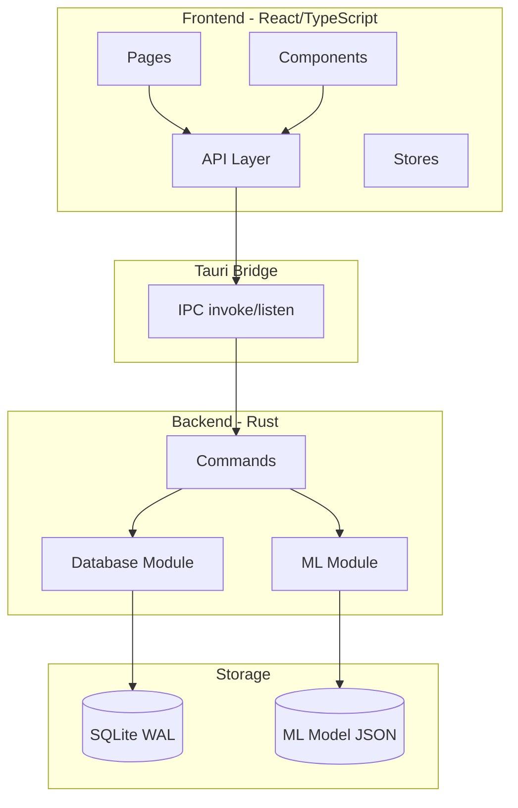
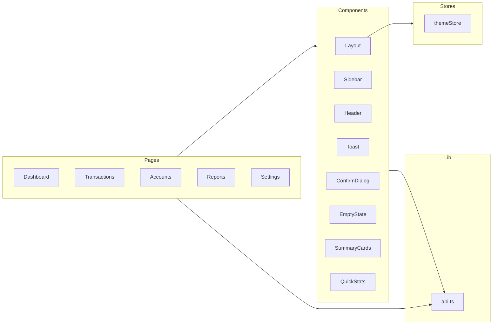
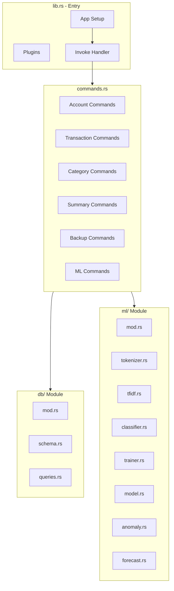
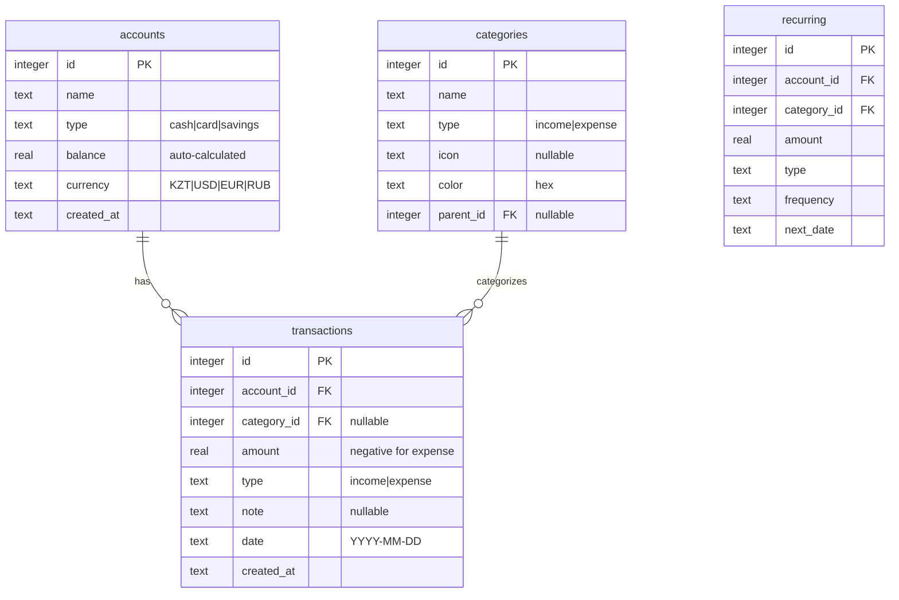

# Finance App — Architecture

Technical documentation for the desktop personal finance application.

---

## Table of contents

1. [System overview](#1-system-overview)
2. [Architecture layers](#2-architecture-layers)
3. [Database schema](#3-database-schema)
4. [API reference](#4-api-reference)
5. [ML pipeline](#5-ml-pipeline)
6. [Data flow](#6-data-flow)
7. [File structure](#7-file-structure)
8. [Security and validation](#8-security-and-validation)
9. [Storage](#9-storage)
10. [UI/UX design system](#10-uiux-design-system)
11. [Roadmap](#11-roadmap)

---

## 1. System overview

A desktop personal finance app that runs fully **offline**. All data is stored locally in SQLite. A built-in ML module predicts transaction categories and detects spending anomalies.

### Tech stack

| Layer | Technologies |
|-------|--------------|
| **Frontend** | React 19, TypeScript 5.8, Tailwind CSS 4, Vite 7, React Router 7, Recharts 3.7 |
| **Backend** | Rust 2021, Tauri 2, rusqlite 0.32 |
| **Database** | SQLite (WAL mode) |
| **ML** | Native Rust (TF-IDF, Naive Bayes) |

### High-level architecture



---

## 2. Architecture layers

### 2.1 Frontend layer

**Technologies:** React 19, TypeScript 5.8, Tailwind CSS 4, Vite 7



**Key files**

| File | Purpose |
|------|---------|
| `src/App.tsx` | Routing (React Router 7) |
| `src/lib/api.ts` | Tauri `invoke` wrappers |
| `src/stores/themeStore.ts` | Theme (localStorage) |
| `src/hooks/useDebounce.ts` | Debounce for ML predictions |

### 2.2 Backend layer

**Technologies:** Rust 2021, Tauri 2, rusqlite 0.32



**Key files**

| File | Purpose |
|------|---------|
| `src-tauri/src/lib.rs` | Entry point, command registration |
| `src-tauri/src/commands.rs` | Tauri commands |
| `src-tauri/src/db/queries.rs` | SQL operations |
| `src-tauri/src/ml/` | Machine learning module |

---

## 3. Database schema

### ER diagram



### Indexes

```sql
CREATE INDEX IF NOT EXISTS idx_transactions_date ON transactions(date);
CREATE INDEX IF NOT EXISTS idx_transactions_account ON transactions(account_id);
CREATE INDEX IF NOT EXISTS idx_transactions_category ON transactions(category_id);
```

### Default categories

| Category | Type | Color |
|----------|------|-------|
| Salary | income | `#22c55e` |
| Freelance | income | `#3b82f6` |
| Food | expense | `#ef4444` |
| Transport | expense | `#f97316` |
| Utilities | expense | `#eab308` |
| Health | expense | `#ec4899` |
| Entertainment | expense | `#8b5cf6` |
| Clothing | expense | `#06b6d4` |
| Other | expense | `#64748b` |

---

## 4. API reference

### 4.1 Accounts API

| Command | Input | Output | Description |
|---------|-------|--------|-------------|
| `get_accounts` | — | `Vec<Account>` | List all accounts |
| `create_account` | `{name, account_type, currency?}` | `i64` | Create account |
| `update_account` | `{id, name, account_type, currency?}` | `()` | Update account |
| `delete_account` | `id: i64` | `()` | Delete (only if no transactions) |

### 4.2 Categories API

| Command | Input | Output | Description |
|---------|-------|--------|-------------|
| `get_categories` | — | `Vec<Category>` | List all categories |

### 4.3 Transactions API

| Command | Input | Output | Description |
|---------|-------|--------|-------------|
| `get_transactions` | filters (limit, account_id, date_from, date_to, etc.) | `Vec<TransactionWithDetails>` | List with filters |
| `create_transaction` | `{account_id, category_id?, amount, transaction_type, note?, date}` | `i64` | Create |
| `update_transaction` | `{id, ...}` | `()` | Update |
| `delete_transaction` | `id: i64` | `()` | Delete |
| `create_transfer` | `{from_account_id, to_account_id, amount, date, note?}` | `()` | Transfer between accounts |

### 4.4 Analytics API

| Command | Input | Output | Description |
|---------|-------|--------|-------------|
| `get_summary` | — | `Summary` | Balance, income/expense for month |
| `get_expense_by_category` | `{year, month}` | `Vec<CategoryTotal>` | Expenses by category |
| `get_monthly_totals` | `{months?}` | `Vec<MonthlyTotal>` | Monthly stats |

### 4.5 Backup API

| Command | Input | Output | Description |
|---------|-------|--------|-------------|
| `export_backup` | — | `String` | Create backup, return path |
| `restore_backup` | `path: String` | `()` | Restore from file |

### 4.6 ML API

| Command | Input | Output | Description |
|---------|-------|--------|-------------|
| `predict_category` | `note: String` | `Option<CategoryPrediction>` | Predict category |
| `train_model` | — | `TrainResult` | Train model |
| `get_model_status` | — | `ModelStatus` | Model status |
| `get_insights` | — | `Insights` | Anomalies and forecast |

---

## 5. ML pipeline

### 5.1 Overview

- **Training:** Load transactions → tokenize → TF-IDF → Naive Bayes → cross-validate → save model.
- **Inference:** Input note → tokenize → TF-IDF transform → predict → return if confidence ≥ 0.3.

### 5.2 Tokenizer

**File:** `src-tauri/src/ml/tokenizer.rs`

- Unicode-aware word splitting
- Lowercase normalization
- Stop-words (Russian, Kazakh, transactional)
- Min length 2, no numeric-only tokens

### 5.3 TF-IDF

**File:** `src-tauri/src/ml/tfidf.rs`

- Smoothed IDF, normalized TF, L2-normalized vectors

### 5.4 Naive Bayes

**File:** `src-tauri/src/ml/classifier.rs`

- Multinomial Naive Bayes with Laplace smoothing (alpha=1)
- Log-space computation, softmax for confidence
- Confidence threshold: **0.3**

### 5.5 Anomaly detection

**File:** `src-tauri/src/ml/anomaly.rs`

- Z-score: `z = (value - mean) / std`
- Warning at z > 2, alert at z > 3

### 5.6 Expense forecasting

**File:** `src-tauri/src/ml/forecast.rs`

- Simple exponential smoothing (alpha=0.3)
- 95% confidence interval, trend: up / down / stable

---

## 6. Data flow

### Create transaction

UI → `api.createTransaction()` → Tauri `invoke("create_transaction")` → `commands.rs` → validate → `queries.create_transaction()` → INSERT + UPDATE balance → return id.

### ML category prediction

User types note (debounce) → `predictCategory(note)` → load model → tokenize → TF-IDF → Naive Bayes → return `Some(prediction)` if confidence ≥ 0.3.

### Transfer

`create_transfer(from, to, amount)` → BEGIN TRANSACTION → INSERT expense (from) + UPDATE from balance → INSERT income (to) + UPDATE to balance → COMMIT.

---

## 7. File structure

```
finance-app/
├── src/                    # Frontend
│   ├── App.tsx, main.tsx, index.css
│   ├── pages/              # Dashboard, Transactions, Accounts, Reports, Settings, etc.
│   ├── components/         # layout/, dashboard/, ui/
│   ├── lib/                # api.ts, format.ts, i18n
│   ├── locales/            # kk.json, ru.json, en.json
│   ├── hooks/
│   └── stores/
├── src-tauri/
│   └── src/
│       ├── lib.rs
│       ├── commands.rs
│       ├── db/             # mod.rs, schema.rs, queries.rs
│       └── ml/             # tokenizer, tfidf, classifier, model, trainer, anomaly, forecast
├── docs/
├── e2e/
└── package.json, vite.config.ts, tsconfig.json, tailwind.config.ts
```

---

## 8. Security and validation

### Input validation (backend)

All validation in `commands.rs` before DB operations.

- **Accounts:** non-empty name, whitelist type/cash/card/savings, currency length.
- **Transactions:** amount > 0, valid type and date, account and category exist and match type.
- **Backup restore:** file exists, SQLite header check.

### Data integrity

- Auto-balance on transaction CRUD
- Atomic transfers (single transaction)
- No account delete if it has transactions (or reassign first)
- Foreign keys in schema

### SQL injection

Parameterized statements only via `rusqlite::params!`.

---

## 9. Storage

### Database paths

| Platform | Path |
|----------|------|
| **macOS** | `~/Library/Application Support/com.kuralbekadilet475.finance-app/finance.db` |
| **Windows** | `%APPDATA%/com.kuralbekadilet475.finance-app/finance.db` |
| **Linux** | `~/.local/share/finance-app/finance.db` |

### SQLite pragmas

```sql
PRAGMA journal_mode=WAL;
PRAGMA synchronous=NORMAL;
```

### ML model

- Stored as JSON next to DB: `category_model.json` (or `ml_model.json` per implementation)

---

## 10. UI/UX design system

### Colors

| Token | Light | Dark | Use |
|-------|-------|------|-----|
| Income | `#22c55e` | `#22c55e` | Positive amounts |
| Expense | `#ef4444` | `#ef4444` | Negative amounts |
| Background | `#f4f4f5` | `#09090b` | App background |
| Card | `#ffffff` | `#18181b` | Card background |

### Animations

- `animate-fade-in`, `animate-slide-down`, `animate-slide-up`, `animate-scale-in`, `animate-shake`, `animate-stagger-N`

### Account types

| Type | Icon | Gradient |
|------|------|----------|
| cash | Banknote | Emerald |
| card | CreditCard | Blue |
| savings | PiggyBank | Purple |

---

## 11. Roadmap

### Implemented

- Accounts, transactions, transfers, recurring payments
- Dashboard, reports, insights
- Dark/light theme, backup/restore
- ML: category prediction, anomaly detection, expense forecast
- Budgets (weekly/monthly/yearly), alerts in header
- Multi-currency (base currency, exchange rates)
- Category hierarchy (parent_id), export filters, import CSV/JSON/XLSX
- Transaction pagination (“Load more”), reassign transactions on account delete

### Future

- Multi-profile (multiple users)
- Richer charts and reports
- Notifications (e.g. budget alerts)

---

**License:** MIT  
**Author:** kuralbekadilet475
